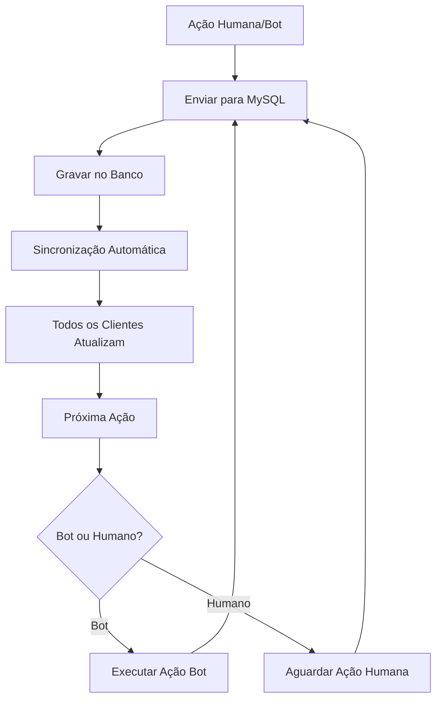

# 🔧 CORREÇÃO - MYSQL COMO ÚNICA FONTE DE VERDADE DO DRAFT

## 📋 PROBLEMA IDENTIFICADO

Quando um jogador real faz seu pick, os bots param e o draft não continua. O sistema não estava usando o MySQL como única fonte de verdade, causando:

- Draft parando após ações humanas
- Bots não continuando automaticamente
- Falta de sincronização em tempo real
- Inconsistências entre clientes

## 🎯 SOLUÇÃO IMPLEMENTADA

### 1. **MySQL como Fonte Única de Verdade**

#### ✅ Fluxo Corrigido



### 2. **Correções no Frontend (draft-pick-ban.ts)**

#### ✅ `checkForBotAutoAction()` - Bots Continuam Funcionando

```typescript
// ✅ CORREÇÃO: SEMPRE enviar ação de bot para backend (MySQL) - TODOS os clientes
if (this.session && this.session.currentAction > 0 && this.matchData?.id) {
    const completedPhase = this.session.phases[this.session.currentAction - 1];
    if (completedPhase && completedPhase.champion) {
        await this.sendDraftActionToBackend(completedPhase.champion, completedPhase.action);
        
        // ✅ CORREÇÃO: Continuar para próxima ação após sincronização
        setTimeout(() => {
            if (this.session && this.session.currentAction < this.session.phases.length) {
                this.updateCurrentTurn();
            }
        }, 500);
    }
}
```

#### ✅ `onChampionSelected()` - Ações Humanas Gravam no MySQL

```typescript
// ✅ CORREÇÃO: Aguardar sincronização e deixar o MySQL continuar o draft
setTimeout(() => {
    console.log('🔄 [onChampionSelected] Sincronização concluída - deixando MySQL continuar o draft');
    
    // ✅ CORREÇÃO: NÃO chamar updateCurrentTurn() aqui - deixar a sincronização automática fazer isso
    this.forceInterfaceUpdate();
    
    // ✅ NOVO: Forçar continuação do draft após ação humana
    setTimeout(async () => {
        await this.forceDraftContinue();
    }, 500);
}, 1500);
```

#### ✅ `handleDraftDataSync()` - Sincronização Automática

```typescript
// ✅ CORREÇÃO: Continuar o draft automaticamente após sincronização
if (this.session.currentAction >= this.session.phases.length) {
    console.log('🎉 [DraftPickBan] Sessão completada após sincronização!');
    this.session.phase = 'completed';
    this.stopTimer();
    this.stopAutoSync();
} else {
    // ✅ CORREÇÃO: Continuar o draft automaticamente após sincronização
    console.log('🔄 [DraftPickBan] Continuando draft após sincronização...');
    this.updateCurrentTurn();
}
```

### 3. **Novo Endpoint no Backend**

#### ✅ `/api/draft/continue` - Forçar Continuação

```typescript
app.post('/api/draft/continue', (async (req: Request, res: Response) => {
    const { matchId, playerId } = req.body;
    
    // ✅ NOVO: Notificar todos os clientes sobre a continuação
    if (wss) {
        const message = {
            type: 'draft_continue',
            data: { matchId, playerId, timestamp: new Date().toISOString() }
        };
        
        wss.clients.forEach((client: WebSocket) => {
            if (client.readyState === WebSocket.OPEN) {
                client.send(JSON.stringify(message));
            }
        });
    }
    
    res.json({ success: true, message: 'Continuação do draft forçada com sucesso' });
}) as RequestHandler);
```

## 🔄 FLUXO CORRIGIDO

### 1. **Ação de Jogador Humano**

```mermaid
1. Jogador seleciona campeão
2. Enviar para MySQL (/api/match/draft-action)
3. Aguardar confirmação (1.5s)
4. Forçar continuação (/api/draft/continue)
5. Sincronização automática (1s)
6. Próxima ação (bot ou humano)
```

### 2. **Ação de Bot**

```mermaid
1. Bot detectado automaticamente
2. Executar ação do bot
3. Enviar para MySQL (TODOS os clientes)
4. Aguardar sincronização (300ms)
5. Continuar para próxima ação
6. Sincronização automática (1s)
```

### 3. **Sincronização Automática**

```mermaid
1. Polling a cada 1 segundo
2. Verificar mudanças no MySQL
3. Aplicar ações sincronizadas
4. Continuar draft automaticamente
5. Atualizar interface
```

## 📊 MELHORIAS IMPLEMENTADAS

### 1. **Tempos Otimizados**

- Sincronização automática: 1 segundo
- Ação de bot: 300ms após execução
- Ação humana: 1.5s após envio
- Continuação forçada: 500ms após sincronização

### 2. **Proteções Adicionadas**

- Verificação de duplicação por actionIndex
- Proteção contra regressão de ações
- Validação de ordem sequencial
- Controle de erros repetitivos

### 3. **Logs Melhorados**

- Logs específicos para cada tipo de ação
- Debug detalhado para ações humanas vs bots
- Controle de spam nos logs
- Rastreamento completo do fluxo

## 🧪 TESTES RECOMENDADOS

### 1. **Teste de Ação Humana**

- Fazer pick como jogador real
- Verificar se ação é gravada no MySQL
- Confirmar se bots continuam funcionando
- Verificar sincronização entre clientes

### 2. **Teste de Ação de Bot**

- Aguardar ação de bot
- Verificar se ação é gravada no MySQL
- Confirmar se próximo jogador é detectado
- Verificar sincronização automática

### 3. **Teste de Concorrência**

- Múltiplos clientes simultâneos
- Ações rápidas em sequência
- Verificar consistência dos dados
- Confirmar que MySQL é fonte única

## ✅ RESULTADO ESPERADO

Com essas correções, o sistema deve:

- ✅ Gravar TODAS as ações no MySQL (humanas e bots)
- ✅ Continuar o draft automaticamente após cada ação
- ✅ Manter todos os clientes sincronizados em tempo real
- ✅ Usar o MySQL como única fonte de verdade
- ✅ Funcionar de forma consistente e confiável

## 🚀 PRÓXIMOS PASSOS

### 1. **Monitoramento**

- Implementar métricas de sincronização
- Alertas para falhas de continuação
- Dashboard de status do draft

### 2. **Otimizações Futuras**

- WebSocket para notificações em tempo real
- Cache inteligente para reduzir consultas
- Compressão de dados para melhor performance

### 3. **Validações Adicionais**

- Verificação de integridade dos dados
- Rollback automático em caso de inconsistência
- Backup automático do estado do draft

---

**Status**: ✅ IMPLEMENTADO  
**Data**: $(date)  
**Versão**: 1.0.0
